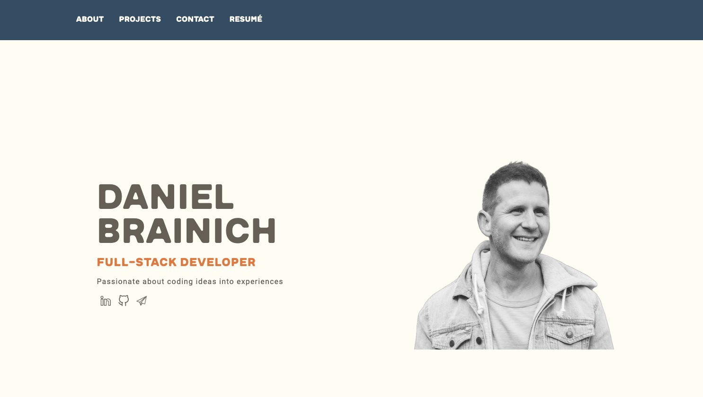

## Description
This repository contains my personal portfolio website, which showcases my resume, projects, skills, and a contact form. It's a React single-page application that demonstrates my proficiency in modern web development and SPA architecture. I applied Bootstrap for responsive design and crafted a minimalist theme for a clean and user-friendly interface.

## Screenshot

## Tech Stack

### Frontend:
- HTML
- CSS
- JavaScript
- React
- Bootstrap
- [EmailJS](https://www.emailjs.com/) (for handling email sending functionality)

### DevOps:
- Heroku (for deployment)
- SiteGround (for hosting)

### Version Control:
- Git
- GitHub

## License
This project is licensed under the Apache License 2.0. See the [LICENSE](./LICENSE) file for details.
